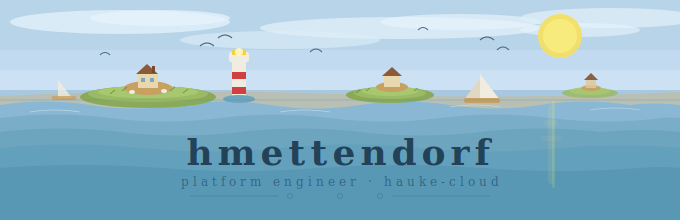

</img>

---

## 👋 About Me

I'm a **Platform & Infrastructure Engineer** building cloud-native infrastructure at **[hauke-cloud](https://github.com/hauke-cloud)** — a GitHub organization focused on immutable, automated, and self-healing infrastructure on top of Hetzner Cloud and Kubernetes.

My work centers on building reliable, reproducible infrastructure using **Fedora CoreOS**, **Packer**, **Helm**, and **Kubernetes** — with automation and GitOps at the core.

---

## 🏢 hauke-cloud — Featured Work

> Most of my active contributions live under the **[hauke-cloud](https://github.com/hauke-cloud)** organization. Here's a tour of the key projects:

<table>
  <tr>
    <td width="50%" valign="top">
      <h3>🔧 <a href="https://github.com/hauke-cloud/packer-fedora-coreos">packer-fedora-coreos</a></h3>
      
Packer template to build <strong>Fedora CoreOS</strong> images directly on <strong>Hetzner Cloud</strong>. Produces immutable, minimal OS snapshots ready for Kubernetes node deployment — no SSH, no packages, no drift.

      
      
      
    </td>
    <td width="50%" valign="top">
      <h3>🗂️ <a href="https://github.com/hauke-cloud/fedora-coreos-images">fedora-coreos-images</a></h3>
      
Repository distributing <strong>Fedora CoreOS ISO files and iPXE images</strong>, automated via GitHub Actions with 119+ commits. Serves as the artifact store for bootstrapping bare-metal and cloud nodes from scratch.

      
      
      
    </td>
  </tr>
</table>

---

## 🛠️ Tech Stack

**Infrastructure & Orchestration**

**OS & Runtime**

**Cloud & Languages**

---

## 📊 GitHub Stats

---

## 🏆 Achievements

| 🦈 Pull Shark ×2 | 🎯 YOLO |
|:---:|:---:|
| Merging pull requests like clockwork | Merged without a review |

---

## 🔗 Links

---

<svg width="100%" viewBox="0 0 680 40" role="img" xmlns="http://www.w3.org/2000/svg">
  <title>Footer wave</title><desc>Simple Wadden Sea footer wave</desc>
  <path d="M0 10 Q85 0 170 10 Q255 20 340 10 Q425 0 510 10 Q595 20 680 10 L680 40 L0 40 Z" fill="#5898b4"/>
  <path d="M0 18 Q85 8 170 18 Q255 28 340 18 Q425 8 510 18 Q595 28 680 18 L680 40 L0 40 Z" fill="#4a88a4"/>
</svg>

*Building immutable infrastructure, one Packer template at a time.*

